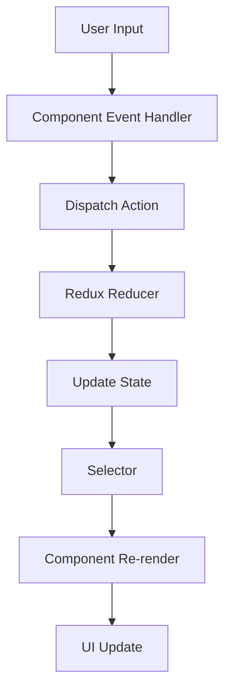

## Redux Store Configuration

Super Hexagon uses Redux Toolkit for predictable state management. The store is configured in `src/redux/store.ts` with a single game slice:

```typescript title="src/redux/store.ts"
import { configureStore } from '@reduxjs/toolkit'
import gameReducer from './slices/game'

export const store = configureStore({
  reducer: {
    game: gameReducer,
  },
})

// Infer the `RootState` and `AppDispatch` types from the store itself
export type RootState = ReturnType<typeof store.getState>
export type AppDispatch = typeof store.dispatch
```

The store exports TypeScript types (`RootState` and `AppDispatch`) that are used throughout the application for type-safe state access.

## Store Provider

The Redux store is provided to the React tree using a client-side wrapper component:

```tsx title="src/redux/Provider/StoreProvider.tsx"
'use client'
import { Provider } from 'react-redux'
import { store } from '~redux/store'

export const StoreProvider = ({ children }: { children: React.ReactNode }) => {
  return <Provider store={store}>{children}</Provider>
}
```

<Note>
  The `'use client'` directive is required because Redux uses React Context, which only works in client components in Next.js 13+.
</Note>

## Game Slice Structure

The game slice (`src/redux/slices/game.ts`) manages all game-related state in a single location.

### State Shape

```typescript title="Type Definitions"
export type Position = {
  x: number
  y: number
}

export type PlayerState = {
  isPLaying: boolean
  player: {
    hitbox1: Position | null
    hitbox2: Position | null
    hitbox3: Position | null
  }
  angle: string
  score: number
  bestScore?: number
  spawnIntervalId?: NodeJS.Timer
  playerIntervalId?: NodeJS.Timer
  volume: number
}
```

The state includes:

- **isPLaying**: Boolean flag controlling game/menu rendering
- **player**: Three hitbox positions for collision detection
- **angle**: Current rotation angle of the game board as a string
- **score**: Current game score (increments as obstacles pass)
- **bestScore**: High score across all plays
- **spawnIntervalId**: Reference to obstacle spawn interval
- **playerIntervalId**: Reference to player update interval
- **volume**: Audio volume level (0-1)

### Initial State

```typescript title="Initial State"
const initialState: PlayerState = {
  isPLaying: false,
  player: { hitbox1: null, hitbox2: null, hitbox3: null },
  angle: '0',
  score: 0,
  volume: 0.4,
}
```

## Actions

The game slice exposes 11 actions for state management:

### Game Control Actions

```typescript title="Play/Pause Actions"
play: (state) => {
  state.isPLaying = true
}

pause: (state) => {
  state.isPLaying = false
}
```

These toggle between game and menu views.

### Audio Actions

```typescript title="Volume Control"
switchVolume: (state, action: PayloadAction<number>) => {
  state.volume = action.payload
}
```

Updates the audio volume with a value between 0 and 1.

### Interval Management Actions

```typescript title="Interval References"
setSpawnIntervalId: (state, action: PayloadAction<NodeJS.Timer>) => {
  state.spawnIntervalId = action.payload
}

setPlayerIntervalId: (state, action: PayloadAction<NodeJS.Timer>) => {
  state.playerIntervalId = action.payload
}
```

Store interval IDs for cleanup when the game ends.

### Player Actions

```typescript title="Player State Updates"
updatePosition: (
  state,
  action: PayloadAction<{
    hitbox1: Position | null
    hitbox2: Position | null
    hitbox3: Position | null
  }>
) => {
  if (action.payload) state.player = { ...action.payload }
}

updateAngle: (
  state,
  action: PayloadAction<{ angle: string | undefined | null }>
) => {
  if (action.payload?.angle) state.angle = action.payload.angle
}
```

Update player position and board rotation for collision detection.

### Score Actions

```typescript title="Score Management"
updateScore: (state) => {
  state.score += 1
}

updateBestScore: (state) => {
  if (state.score > (state?.bestScore ?? 0)) state.bestScore = state.score
}
```

Increment score as obstacles pass and update best score on game over.

### Reset Action

```typescript title="Game Reset"
resetGame: (state) => {
  state.player = { hitbox1: null, hitbox2: null, hitbox3: null }
  state.angle = '0'
  state.score = 0
}
```

Reset game state when starting a new game.

## Selectors

Selectors are organized in `src/redux/selectors/` and use `createSelector` for memoization.

### Player Selectors

```typescript title="src/redux/selectors/player.ts"
import { createSelector } from '@reduxjs/toolkit'
import { RootState } from '~redux/store'

const selectGameState = (state: RootState) => state.game.player

export const selectPlayerH1 = createSelector(
  selectGameState,
  (player) => player.hitbox1
)

export const selectPlayerH2 = createSelector(
  selectGameState,
  (player) => player.hitbox2
)

export const selectPlayerH3 = createSelector(
  selectGameState,
  (player) => player.hitbox3
)
```

These selectors expose individual player hitbox positions for collision detection in the `Line` component.

### Score Selectors

```typescript title="src/redux/selectors/score.ts"
const selectScoreState = (state: RootState) => state.game.score

export const selectScore = createSelector(selectScoreState, (score) =>
  Math.floor(score / 5)
)

export const selectBestScore = createSelector(
  selectBestScoreState,
  (bestScore) => bestScore
)
```

<Note>
  The score is divided by 5 for display purposes, making the game progression feel more balanced.
</Note>

### Playing State Selector

```typescript title="src/redux/selectors/isPlaying.ts"
const selectIsPlayingState = (state: RootState) => state.game.isPLaying

export const selectIsPLaying = createSelector(
  selectIsPlayingState,
  (isPLaying) => isPLaying
)
```

Used by the `Game` component to conditionally render game or menu.

### Angle Selector

```typescript title="src/redux/selectors/angle.ts"
const selectAngleState = (state: RootState) => state.game.angle

export const selectAngle = createSelector(selectAngleState, (angle) => angle)
```

Provides the current board rotation angle for collision calculations.

### Volume Selectors

```typescript title="src/redux/selectors/volume.ts"
const selectVolumeState = (state: RootState) => state.game.volume

export const selectVolume = createSelector(
  selectVolumeState,
  (volume) => volume
)

export const selectIsVolumeEnabled = createSelector(
  selectVolumeState,
  (volume) => volume > 0
)
```

The `selectIsVolumeEnabled` selector is a computed value that determines whether audio should play.

### Interval Selectors

```typescript title="src/redux/selectors/intervals.ts"
const selectIntervalsState = (state: RootState) => state.game

export const selectPlayerIntervalId = createSelector(
  selectIntervalsState,
  (interval) => interval.playerIntervalId
)

export const selectSpawnIntervalId = createSelector(
  selectIntervalsState,
  (interval) => interval.spawnIntervalId
)
```

These selectors provide interval references for cleanup when the game ends.

## Usage Examples

### Dispatching Actions

```tsx title="Menu Component Starting Game"
import { useDispatch } from 'react-redux'
import { play, resetGame } from '~redux/slices/game'

const dispatch = useDispatch()

const handlePLay = () => {
  dispatch(resetGame())
  dispatch(play())
}
```

### Reading State with Selectors

```tsx title="Line Component Collision Detection"
import { useSelector } from 'react-redux'
import { selectPlayerH1, selectPlayerH2, selectPlayerH3 } from '~redux/selectors/player'
import { selectAngle } from '~redux/selectors/angle'

const hitbox1 = useSelector(selectPlayerH1)
const hitbox2 = useSelector(selectPlayerH2)
const hitbox3 = useSelector(selectPlayerH3)
const boardAngle = +useSelector(selectAngle)
```

### Updating Complex State

```tsx title="Player Component Position Update"
import { updatePosition } from '~redux/slices/game'

useEffect(() => {
  const hitbox1 = {
    x: refHitbox1.current?.getBoundingClientRect().x ?? 0,
    y: refHitbox1.current?.getBoundingClientRect().y ?? 0,
  }
  const hitbox2 = {
    x: refHitbox2.current?.getBoundingClientRect().x ?? 0,
    y: refHitbox2.current?.getBoundingClientRect().y ?? 0,
  }
  const hitbox3 = {
    x: refHitbox3.current?.getBoundingClientRect().x ?? 0,
    y: refHitbox3.current?.getBoundingClientRect().y ?? 0,
  }

  dispatch(updatePosition({ hitbox1, hitbox2, hitbox3 }))
}, [degres, dispatch])
```

## State Flow Diagram



## Best Practices

<CardGroup cols={2}>
  <Card title="Use Selectors" icon="filter">
    Always use memoized selectors instead of direct state access
  </Card>
  <Card title="Type Safety" icon="shield">
    Leverage TypeScript types exported from the store
  </Card>
  <Card title="Action Creators" icon="bolt">
    Use exported action creators rather than manually creating action objects
  </Card>
  <Card title="Immutable Updates" icon="lock">
    Redux Toolkit uses Immer for immutable updates automatically
  </Card>
</CardGroup>

## Next Steps

<Card title="Components Architecture" href="/architecture/components" icon="layer-group">
  Learn how components consume Redux state and compose together
</Card>