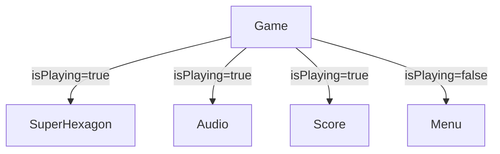

## Overview

The `Game` component is the top-level organism that manages the application's primary view state. It conditionally renders either the active game interface (SuperHexagon, Score, Audio) or the Menu based on the `isPlaying` state from Redux.

## Location

`src/components/organisms/Game/Game.tsx`

## Implementation

The Game component uses Redux to determine which UI to display:

```tsx
import { SuperHexagon } from '~components/organisms/Superhexagon'
import { Menu } from '~components/organisms/Menu'
import { Score } from '~components/atoms/Score'
import { Audio } from '~components/atoms/Audio'
import { useSelector } from 'react-redux'
import { selectIsPLaying } from '~redux/selectors/isPlaying'

export const Game = () => {
  const isPlaying = useSelector(selectIsPLaying)
  return (
    <>
      {isPlaying && <SuperHexagon />}
      {isPlaying && <Audio />}
      {isPlaying && <Score />}
      {!isPlaying && <Menu />}
    </>
  )
}
```

## Architecture

### State Management

The component connects to Redux using the `useSelector` hook to read the `isPlaying` state:

- **Selector**: `selectIsPLaying` from `~redux/selectors/isPlaying`
- **State slice**: `game.isPLaying` (boolean)

### Conditional Rendering

The Game component renders different views based on game state:

<AccordionGroup>
  <Accordion title="Playing State (isPlaying = true)">
    When the game is active, three components render:
    
    1. **SuperHexagon** - The main game canvas with rotating hexagon and obstacles
    2. **Audio** - Background music and sound effects
    3. **Score** - Real-time score display
  </Accordion>
  
  <Accordion title="Menu State (isPlaying = false)">
    When the game is inactive, only the Menu component renders, which displays:
    
    - Game title or score results
    - Play/Play Again button
    - Audio controls
    - Leaderboard (when applicable)
    - Score submission form (after game over)
  </Accordion>
</AccordionGroup>

## Component Relationships

The Game component orchestrates four child components:



### Child Components

<CardGroup cols={2}>
  <Card title="SuperHexagon" icon="hexagon" href="./superhexagon">
    The core game canvas with rotating hexagon, obstacles, and player
  </Card>
  <Card title="Menu" icon="bars" href="./menu">
    Start screen, game over screen, and leaderboard interface
  </Card>
  <Card title="Score" icon="hashtag">
    Real-time score counter displayed during gameplay
  </Card>
  <Card title="Audio" icon="volume-high">
    Background music player with volume controls
  </Card>
</CardGroup>

## State Flow

The `isPlaying` state is controlled by Redux actions dispatched from the Menu component:

1. **Game Start**: Menu dispatches `play()` action → `isPlaying` becomes `true` → Game renders SuperHexagon + Audio + Score
2. **Game Over**: Line collision dispatches `pause()` action → `isPlaying` becomes `false` → Game renders Menu with results
3. **Replay**: Menu dispatches `resetGame()` and `play()` → Game restarts with fresh state

## Props

This component accepts no props. All state is managed through Redux.

## Usage Example

The Game component is typically rendered at the application root:

```tsx
import { Game } from '~components/organisms/Game'
import { StoreProvider } from '~redux/Provider/StoreProvider'

function App() {
  return (
    <StoreProvider>
      <Game />
    </StoreProvider>
  )
}
```

## Design Decisions

### Why Fragment Root?

The component returns a React Fragment (`<>...</>`) rather than a wrapping div to avoid introducing unnecessary DOM nodes. Each child component manages its own positioning and styling.

### Why Conditional Rendering?

Using conditional rendering (`{isPlaying && <Component />}`) rather than CSS visibility ensures:

- Components fully unmount when not needed
- Game intervals and animations clean up properly
- Audio stops when switching to menu
- Memory is freed when game is inactive

### Why Multiple Conditions?

Each playing-state component has its own condition (`{isPlaying && ...}`) rather than wrapping them in a single Fragment. This improves readability and makes it explicit which components appear in each state.

## Related Documentation

<CardGroup cols={2}>
  <Card title="SuperHexagon Component" icon="hexagon" href="./superhexagon">
    Learn about the main game canvas implementation
  </Card>
  <Card title="Menu Component" icon="bars" href="./menu">
    Explore the menu and game over interface
  </Card>
  <Card title="Redux Game Slice" icon="store">
    Understand the game state management
  </Card>
  <Card title="isPlaying Selector" icon="filter">
    View the Redux selector implementation
  </Card>
</CardGroup>