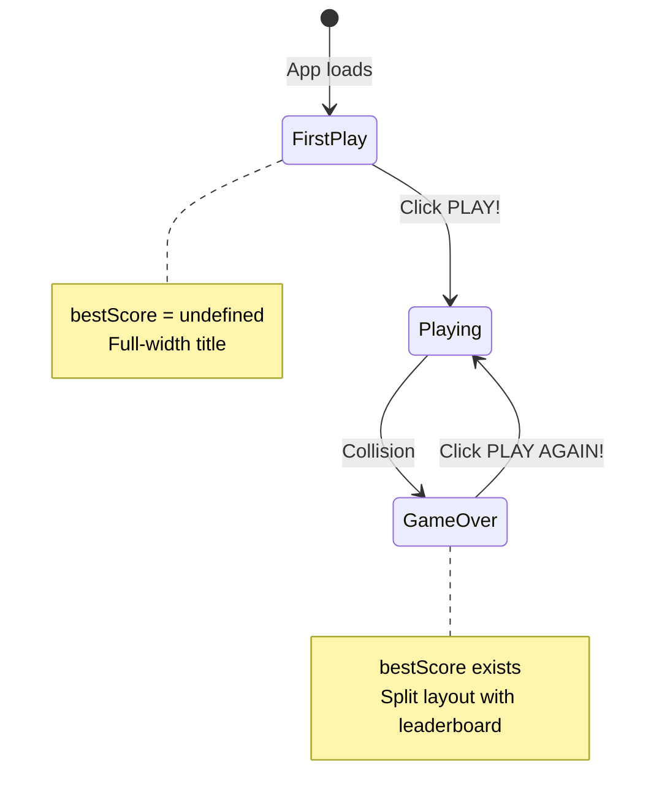

## Overview

The `Menu` component serves as both the start screen and game over screen. It dynamically adjusts its layout and content based on whether the player has a best score (indicating they've played at least once). The component handles game initialization, score display, leaderboard rendering, and audio controls.

## Location

`src/components/organisms/Menu/Menu.tsx`

## Key Features

- **Dual Mode Interface**: Start screen vs. game over screen
- **Dynamic Layout**: Single column (first play) or split view (after playing)
- **Score Submission**: Form for entering player name and submitting scores
- **Leaderboard Display**: Top 10 player rankings
- **Audio Controls**: Volume adjustment interface
- **Game State Management**: Dispatches play and reset actions

## Implementation

### Core Structure

```tsx
import classnames from 'classnames'
import { useDispatch, useSelector } from 'react-redux'
import { AudioController } from '~components/atoms/Audio'
import { selectBestScore, selectScore } from '~redux/selectors/score'
import { play, resetGame } from '~redux/slices/game'

export const Menu = () => {
  const dispatch = useDispatch()
  const score = useSelector(selectScore)
  const bestScore = useSelector(selectBestScore)

  const handlePLay = () => {
    dispatch(resetGame())
    dispatch(play())
  }
  
  return (
    <div className='w-full h-full flex divide-x-2 divide-[#ffc8e4] p-4'>
      {/* Left panel */}
      {/* Right panel (conditional) */}
    </div>
  )
}
```

## Props

This component accepts no props. All state is managed through Redux selectors.

## State Selectors

The component connects to Redux using two selectors:

<ParamField path="score" type="number">
  The player's current or most recent game score. Retrieved via `selectScore` from `~redux/selectors/score`.
</ParamField>

<ParamField path="bestScore" type="number | undefined">
  The player's best score across all sessions. `undefined` if the player has never completed a game. Retrieved via `selectBestScore`.
</ParamField>

## Layout Modes

The Menu component has two distinct visual modes based on the `bestScore` state:

<Tabs>
  <Tab title="First Play Mode">
    When `bestScore` is undefined (player hasn't played yet):
    
    - **Single column layout**: Left panel takes full width
    - **Title display**: Large "SUPERHEXAGON" heading
    - **Centered button**: Play button positioned absolutely at 50-60vh
    - **No right panel**: Leaderboard hidden
    
    ```tsx
    <div className='w-full h-full flex p-4'>
      <div className='w-full flex flex-col p-4 md:p-20'>
        <AudioController />
        <h1 className='text-4xl mt-8 md:text-8xl uppercase'>
          SUPERHEXAGON
        </h1>
        <button className='w-1/2 md:w-1/3 absolute top-[60vh] md:top-[50vh]'>
          PLAY!
        </button>
      </div>
    </div>
    ```
  </Tab>
  
  <Tab title="Game Over Mode">
    When `bestScore` exists (player has completed at least one game):
    
    - **Split layout**: Left and right panels each take 50% width
    - **Score display**: Current score shown in left panel
    - **Submission form**: Name input and submit button
    - **Leaderboard**: Right panel shows top 10 scores
    - **Play again button**: Positioned in normal flow
    
    ```tsx
    <div className='w-full h-full flex divide-x-2 divide-[#ffc8e4] p-4'>
      <div className='w-1/2 flex flex-col p-4 md:p-20'>
        <h2 className='text-3xl md:text-6xl'>Your score</h2>
        <p className='text-5xl md:text-8xl'>{score}</p>
        {/* Score submission form */}
        <button>PLAY AGAIN!</button>
      </div>
      <div className='w-1/2 flex flex-col p-4 md:p-20'>
        <h2 className='text-3xl md:text-6xl'>Leaderboard</h2>
        {/* Leaderboard entries */}
      </div>
    </div>
    ```
  </Tab>
</Tabs>

## Layout Implementation

The component uses dynamic class names via `classnames` to switch between modes:

```tsx
<div
  className={classnames(
    'h-full flex flex-col p-4 md:p-20 justify-between items-center text-white',
    { 'w-1/2': bestScore, 'w-full': !bestScore }
  )}
>
  {/* Left panel content */}
</div>
```

### Responsive Classes

- **Mobile padding**: `p-4` (16px)
- **Desktop padding**: `md:p-20` (80px)
- **Mobile text**: `text-4xl` for title, `text-3xl` for headings
- **Desktop text**: `md:text-8xl` for title, `md:text-6xl` for headings

## Audio Controls

The Menu includes the `AudioController` atom at the top:

```tsx
import { AudioController } from '~components/atoms/Audio'

// Inside Menu component
<AudioController />
```

The AudioController component provides:
- Volume slider
- Mute/unmute toggle
- Persists volume state to Redux via `switchVolume` action

## Play Button Handler

The play button triggers game initialization:

```tsx
const handlePLay = () => {
  dispatch(resetGame())
  dispatch(play())
}
```

### Action Sequence

1. **resetGame()**: Clears player position, angle, and score
   ```typescript
   state.player = { hitbox1: null, hitbox2: null, hitbox3: null }
   state.angle = '0'
   state.score = 0
   ```

2. **play()**: Sets `isPLaying` to `true`
   ```typescript
   state.isPLaying = true
   ```

3. **Game component reacts**: Unmounts Menu, mounts SuperHexagon + Audio + Score

<Note>
  The resetGame() call ensures each play session starts fresh. Without it, previous game state would carry over (player position, rotation angle, etc.).
</Note>

## Score Display

When `bestScore` exists, the menu shows the most recent score:

```tsx
{!!bestScore && (
  <>
    <h2 className='text-3xl md:text-6xl shadow-lg uppercase'>
      Your score
    </h2>
    <p className='text-5xl md:text-8xl shadow-lg'>{score}</p>
  </>
)}
```

The score value comes from Redux `selectScore` selector, which reads `state.game.score`. This score:
- Increments during gameplay via `updateScore()` action
- Resets to 0 on `resetGame()` action
- Persists until next game starts

## Score Submission Form

The component includes a form for submitting scores to a leaderboard:

```tsx
{!!bestScore && (
  <div className='flex flex-col gap-4'>
    <p className='w-64 text-center font-semibold text-xl uppercase'>
      {'submit your score'}
    </p>
    <form>
      <input
        className='w-full h-8 md:h-10 rounded-md border-2 border-white bg-black px-4'
        placeholder='Name'
        type='text'
      />
    </form>
    <button
      type='submit'
      className='group w-64 py-1 px-2 md:p-2 border-2 rounded-md shadow-md font-semibold hover:shadow-[#ff99cc] uppercase'
    >
      <p className='group-hover:drop-shadow-[2px_2px_2px_rgba(255,153,204,1)]'>
        {'submit'}
      </p>
    </button>
  </div>
)}
```

### Form Styling

<ParamField path="input" type="element">
  - Background: Black (`bg-black`)
  - Border: 2px white (`border-2 border-white`)
  - Padding: 16px horizontal (`px-4`)
  - Height: 32px mobile, 40px desktop (`h-8 md:h-10`)
</ParamField>

<ParamField path="button" type="element">
  - Border: 2px white
  - Hover effect: Pink shadow (`hover:shadow-[#ff99cc]`)
  - Text effect: Pink drop shadow on hover
</ParamField>

<Warning>
  The form currently has no `onSubmit` handler. The submission logic is not implemented in this version of the code.
</Warning>

## Leaderboard Display

The right panel shows a mock leaderboard when `bestScore` exists:

```tsx
{bestScore && (
  <div className='w-1/2 h-full flex flex-col justify-between items-center p-4 md:p-20 text-white text-center'>
    <h2 className='text-3xl md:text-6xl uppercase'>Leaderboard</h2>
    <div className='w-full h-full flex flex-col justify-evenly items-center py-2 md:py-8 px-8 md:px-24'>
      {[...new Array(10)].map((_, idx) => {
        return (
          <div
            key={idx}
            className='w-full flex justify-between text-lg md:text-2xl'
          >
            <span>Player {idx}</span>
            <span>
              {idx}
              {idx}
              {idx}
            </span>
          </div>
        )
      })}
    </div>
  </div>
)}
```

### Leaderboard Structure

- **10 entries**: Generated via `[...new Array(10)].map()`
- **Mock data**: Shows "Player 0" through "Player 9" with scores like "000", "111", etc.
- **Layout**: Flex row with space-between for player name and score
- **Responsive text**: `text-lg` mobile, `text-2xl` desktop

<Note>
  The leaderboard currently displays placeholder data. In a production implementation, this would fetch real scores from a backend API.
</Note>

## Button Styling

The play button has dynamic styling based on game state:

```tsx
<button
  type='button'
  className={classnames(
    'group w-64 p-2 md:p-3 border-2 rounded-md shadow-md font-semibold hover:shadow-[#ff99cc] uppercase',
    {
      'w-64': bestScore,
      'w-1/2 md:w-1/3 absolute top-[60vh] md:top-[50vh]': !bestScore,
    }
  )}
  onClick={handlePLay}
>
  <p className='group-hover:drop-shadow-[2px_2px_2px_rgba(255,153,204,1)]'>
    {!bestScore ? 'PLAY!' : 'PLAY AGAIN!'}
  </p>
</button>
```

### Button States

<Tabs>
  <Tab title="First Play">
    - Width: 50% mobile, 33% desktop (`w-1/2 md:w-1/3`)
    - Position: Absolute at 60vh mobile, 50vh desktop
    - Text: "PLAY!"
  </Tab>
  
  <Tab title="After Playing">
    - Width: 256px (`w-64`)
    - Position: Normal flow (not absolute)
    - Text: "PLAY AGAIN!"
  </Tab>
</Tabs>

### Hover Effects

- **Button shadow**: Changes to pink (`hover:shadow-[#ff99cc]`)
- **Text shadow**: Pink drop shadow with 2px offset (`group-hover:drop-shadow-[2px_2px_2px_rgba(255,153,204,1)]`)

## Color Scheme

The Menu uses a pink/white color palette:

<CodeGroup>

```css Panel Divider
divide-x-2 divide-[#ffc8e4]
/* Light pink divider between left and right panels */
```

```css Button Hover
hover:shadow-[#ff99cc]
/* Medium pink shadow on button hover */
```

```css Text
text-white
/* White text throughout */
```

```css Input
border-2 border-white bg-black
/* White border on black background */
```

</CodeGroup>

## Usage Example

The Menu is conditionally rendered by the Game organism:

```tsx
import { Menu } from '~components/organisms/Menu'
import { useSelector } from 'react-redux'
import { selectIsPLaying } from '~redux/selectors/isPlaying'

export const Game = () => {
  const isPlaying = useSelector(selectIsPLaying)
  return (
    <>
      {!isPlaying && <Menu />}
      {/* other game components */}
    </>
  )
}
```

## State Flow

The Menu component participates in the game lifecycle:



### State Transitions

1. **Initial Load**: Menu renders in first-play mode (`bestScore` undefined)
2. **User clicks PLAY**: `handlePLay()` dispatches `resetGame()` and `play()`
3. **Redux updates**: `isPLaying` becomes `true`
4. **Game component reacts**: Unmounts Menu, mounts SuperHexagon
5. **Collision occurs**: Line component dispatches `pause()` and `updateBestScore()`
6. **Redux updates**: `isPLaying` becomes `false`, `bestScore` set
7. **Game component reacts**: Unmounts SuperHexagon, mounts Menu in game-over mode

## Design Decisions

### Why Conditional Layout?

The split-screen layout only appears after the first game to:
- Maximize impact of title screen on first impression
- Provide context (leaderboard) only when relevant
- Create visual reward for completing first game

### Why Reset Before Play?

Calling `resetGame()` before `play()` ensures:
- Player starts at default rotation (0 degrees)
- Score starts at 0
- Previous hitbox positions cleared
- Clean state for new game session

### Why Mock Leaderboard?

The placeholder leaderboard suggests:
- Future implementation planned
- UI/UX design complete
- Backend integration pending

## Related Documentation

<CardGroup cols={2}>
  <Card title="Game Component" icon="gamepad" href="./game">
    See how Menu integrates with game state management
  </Card>
  <Card title="AudioController" icon="volume-high">
    Learn about the volume control implementation
  </Card>
  <Card title="Redux Game Slice" icon="store">
    Explore play, pause, and resetGame actions
  </Card>
  <Card title="Score Selectors" icon="hashtag">
    Understand score and bestScore state management
  </Card>
</CardGroup>